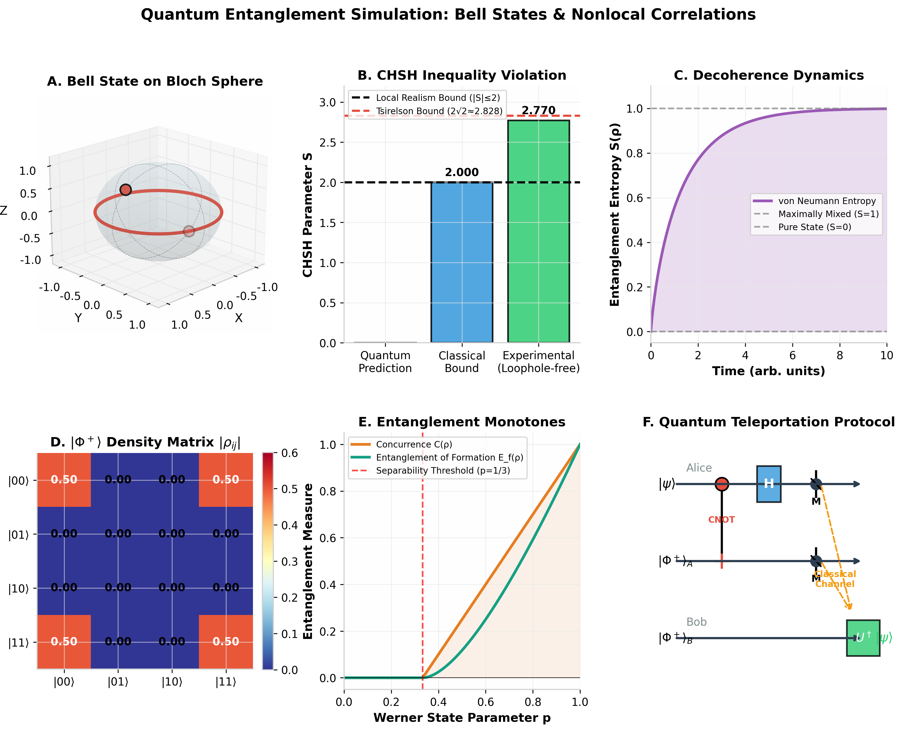

# Quantum Entanglement Simulation

Numerical simulations of Bell states, CHSH inequality violations, decoherence dynamics, entanglement measures, and quantum teleportation using Python.

---

## Project Figure



---

## Features

- Bell state preparation
- Density matrix formalism
- CHSH inequality violation
- Decoherence dynamics
- Entanglement entropy
- Werner states
- Quantum teleportation protocol

---

## Repository Structure

```text
Quantum-Entanglement-Simulation-01
│
├── README.md
├── requirements.txt
├── quantum_entanglement.png
│
├── src/
│   ├── bell_states.py
│   ├── chsh_inequality.py
│   ├── entanglement_monotones.py
│   ├── decoherence.py
│   ├── bloch_sphere.py
│   ├── teleportation.py
│   └── main_figure.py
│
├── tests/
│   └── test_bell_states.py
│
└── notebooks/
```

---

## Physics Implemented

### Bell States

- Φ⁺
- Φ⁻
- Ψ⁺
- Ψ⁻

### CHSH Inequality

Classical limit:

|S| ≤ 2

Quantum limit:

S = 2√2 ≈ 2.828

### Entanglement Measures

- Concurrence
- Entanglement of Formation
- Von Neumann Entropy

### Decoherence

- Density matrices
- Partial trace
- Reduced states
- Entropy evolution

### Quantum Teleportation

Bell measurement → Classical communication → Unitary correction

---

## Requirements

Install packages:

```bash
pip install -r requirements.txt
```

---
## Installation

```bash
pip install -r requirements.txt
```

## Run

```bash
python src/main_figure.py
```

## Testing

```bash
pytest tests/test_bell_states.py
```

## Author

Hadisa Abroo

MPhil Applied Physics

Research Interests:

- Quantum Information
- Quantum Computing
- Quantum Entanglement
- Computational Physics
